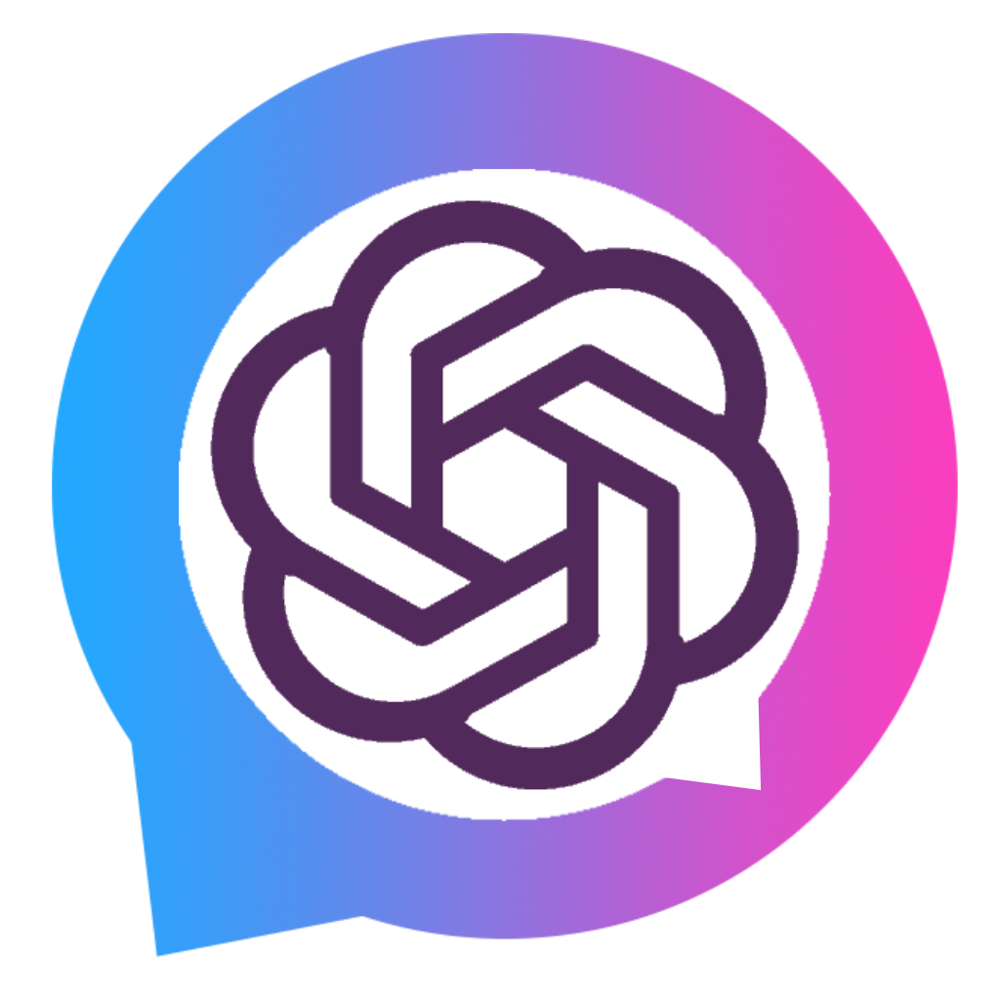
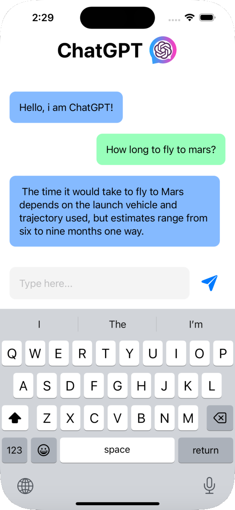

   

# PersonalChatAIApp 
 
### Discription:
It's a lightweight messenger with chatGPT, just ask a question and get an answer. The framework used here is https://github.com/adamrushy/OpenAISwift
 as well as a token from https://platform.openai.com/docs 
This is a trial version and not much has been done here, also note that there is no token file, you will have to add it yourself and just enter your token from openai.com

#### :hammer_and_wrench: Stack :

                                                                                                                                  

